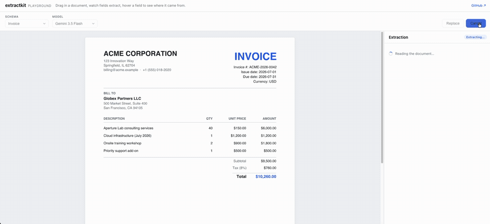

# extractkit



**Extraction you can audit.** Define a Zod schema, feed it a PDF or image, get back schema-validated JSON where every field carries provenance — the page and bounding box it came from — plus a confidence score.

> **Status: v0.1.** The core library ([`packages/core`](./packages/core)), the eval harness ([`packages/evals`](./packages/evals)), and the playground ([`apps/playground`](./apps/playground)) are implemented and tested, and the [benchmark](#benchmark) below is generated from recorded live runs — the OpenAI lineup plus Google's `gemini-3.5-flash` on the CORD-v2 receipt set. Still to come: the Anthropic lineup and the rest of the Gemini tiers, and the DocILE invoice half of the benchmark (blocked on a dataset token). See [ROADMAP.md](./ROADMAP.md).

## Quickstart

```sh
npm install extractkit ai zod
```

`ai` (Vercel AI SDK v7) and `zod` (v4) are peer dependencies. Bring any AI SDK provider — `@ai-sdk/anthropic`, `@ai-sdk/openai`, `@ai-sdk/google`, … — and pass its model to `extract`:

```ts
import { anthropic } from '@ai-sdk/anthropic';
import { extract } from 'extractkit';
import { readFile } from 'node:fs/promises';
import { z } from 'zod';

const invoice = z.object({
  vendor: z.string().describe('Legal name of the issuing company'),
  invoiceNumber: z.string(),
  total: z.number(),
});

const result = await extract({
  schema: invoice,
  document: { data: await readFile('invoice.pdf') },
  model: anthropic('claude-sonnet-5'),
});

result.data.total;   // 1250.5 — validated against the schema
result.fields.total; // { value: 1250.5, confidence: 0.97, page: 0, bbox: { x0: 0.72, y0: 0.81, x1: 0.9, y1: 0.84 } }
```

Streaming, typed failure handling, repair retries, and cost tracking are covered in the [core library docs](./packages/core/README.md).

## Why

TypeScript has structured-output libraries (instructor-js, AI SDK `generateObject`) and document parsers (LiteParse), but nothing that does the full pipeline: **document in → grounded, validated, auditable JSON out** — with a public eval benchmark so the accuracy claims are numbers, not adjectives.

## v1

- **Core library** (`packages/core`, shipped) — Zod schema + PDF/image → validated JSON with per-field `{ value, confidence, page, bbox }`. Provider-agnostic via the Vercel AI SDK. Document validation, typed failure handling, repair retries, streaming, and cost tracking built in. [Usage docs →](./packages/core/README.md)
- **Eval harness** (`packages/evals`, harness shipped) — public benchmark on ~50 pinned real documents (CORD-v2 receipts + DocILE invoices): field accuracy per model, grounding accuracy, cost per 1k docs. Fully reproducible — documents pinned by checksum, reports generated only from recorded runs. [Reproduce it →](./packages/evals/README.md)
- **Playground** (`apps/playground`, built) — drag-drop a document, watch fields stream in, hover a field to highlight its source region on the page. Hono API + Vite/React client, running `extractkit` against a live model. [Run it →](./apps/playground/README.md)

See [ROADMAP.md](./ROADMAP.md) for the build plan.

## Benchmark

<!-- benchmark:start -->

**Receipts — CORD-v2 (photographed shop receipts)**

| Model | Docs | Field accuracy | Grounding hit@0.5 | Mean IoU | Cost / 1k docs |
|---|---|---|---|---|---|
| gpt-5.6-sol | 25 | 94.1% | 82.5% | 66.5% | $57.99 |
| gpt-5.6-luna | 25 | 88.0% | 51.8% | 46.8% | $11.91 |
| gpt-5.4-mini | 25 | 84.7% | 0.4% | 1.4% | $4.77 |
| gemini-3.5-flash | 25 (1 failed) | 96.3% | 82.6% | 66.4% | $27.19 |

<!-- benchmark:end -->

## Scope

General-purpose business documents: invoices, receipts, contracts.

## License

[MIT](./LICENSE)
